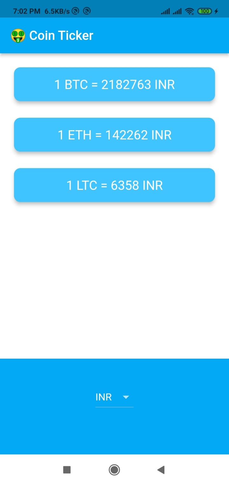

# Bitcoin Ticker 🤑

A Flutter application that provides real-time Bitcoin price information.

## Description

Bitcoin Ticker is a mobile app built with Flutter that allows users to track the latest price of Bitcoin in various currencies. It utilizes an API to fetch real-time data and displays the current Bitcoin price in an easy-to-read format.

## Features

- View the current price of Bitcoin in your selected currency
- Choose from a wide range of supported currencies
- Automatic data updates to ensure real-time information
- Clean and intuitive user interface for a seamless user experience

## Screenshots

## Getting Started

To get started with the Bitcoin Ticker app, follow these steps:

1. Clone the repository:
   git clone https://github.com/Jasil-kk/Bitcoin_ticker.git